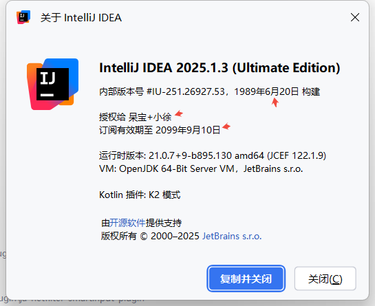
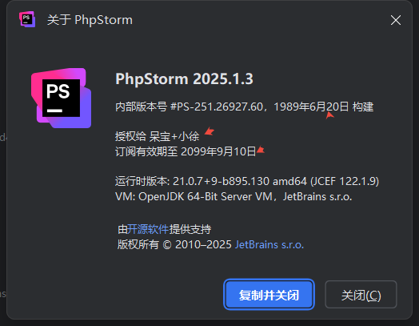

# -JAVA反编译/JAVA局部修复技/JAVA Agent

## 🛑 开头警告！ 🛑

### 【重要】：这篇教程纯粹是给小伙伴们提供技术研究用的，千万别想着用来做坏事哦。有时候装逼一下也是可以的吧，嘻嘻

    想必看到上面几张图,任何一个后端开发人员看到都不会陌生,或许你用过其中一个或许像我都用过

    但你仔细看每张图中的小红标,你就会发现和你的有所不同.似乎一样,似乎又不一样

### 这里我分享你两种处理逻辑:

#### 1. 【从上往下,从现象到本质】 模式去分析

  看到上面图上显示的文字,无非直接写代码里\写配置文件中,这种多语言支持的软件,一看就是写到配置文件中,kv模式存储

  找到配置文件的地方,然后顺着找到代码控制的地方,额,怎么找,各显神通吧

#### 2. 【从下往上,从哪里来到哪里去】 模式去分析
   了解代码的基本逻辑,例如java中的时间显示,它可能直接不是字符串显示,是时间格式转换来的,java中无非就那几个时间类型,依依去分析,最终找到代码控制的地方
   当然,当你做的时候你才会真正知道难点在哪?越底层越麻烦

找到了代码控制的地方,然后就是你的代码了

    为什么这么说呢,这就不得不提一下agent了
    
    你说:啥?agent?Ai Agent和这有关?
    
    子曰:你错了,我说的是Java Agent

## 1、Java Agent

* ### apm场景, 大名鼎鼎的SkyWalking知道吧？不知道算了
* ### 调试场景, idea调试,不会调试不想用调试,那走你
* ### 诊断场景, arthas,线上监控诊断利器,没用过,好吧,你牛逼
  #### 这里重点讲一下arthas的使用 watch\stack\trace\retransform
  #### 线上调试3剑客:
    ##### 1. watch观察函数的输入输出
    ##### 2. stack观察函数被调用的调用路径(从下到上分析)
    ##### 3. trace观察函数内部的调用链(从上到下分析)
  #### 修改函数代码检查无误后,一个retransform热更新完成(此方法慎用)

## 2、常见动态代理3剑客
  ##### 1. CGLIB
  ##### 2. Javassist
  ##### 3. ASM
  ##### 动态编译,arthas的jad/mc,效果咋样?你试试嘛
  #### 上面说的这几种你都不知道,没用过.额,我用的也不多,但是有时候真有用

先把做事大纲理出,然后逐步去实现,到一定程度,你就会发现
事情通了,通则变,变则生,一生二,二生三,三生万物

### 上面分析完如何显示最开始几张图中的自定义显示,其他什么插件都不是问题,万变不离其宗.当然登录/试用的软件有些不一样
##  非登录软件收费问题,无非两个限制:是否已注册/有效期是什么时间,你告诉他就完事了,嘻嘻

[好的软件推荐](https://plugins.jetbrains.com/search?pricingModels=PAID)

### 从java生态到kotlin生态,再到AI Agent,一步一个脚印,走出属于自己的路
